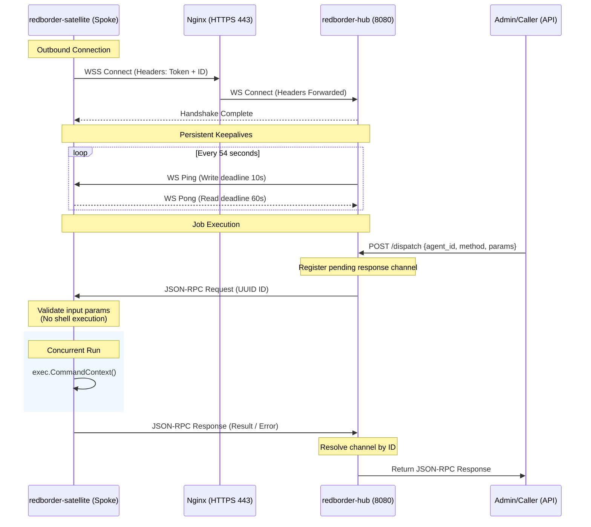

# Redborder Observability Platform (Hub & Satellite)

This repository provides a standard, secure, production-grade Go implementation of a decentralized Hub-and-Spoke Agent model designed for remote network observability. It leverages outbound WebSocket connections to bypass remote NAT and firewall constraints, dispatching predefined monitoring tasks (e.g. Ping and SNMPWalk) using JSON-RPC 2.0 payloads

---

## Architecture Overview



### Key Design Pillars

1. **Connection Stability & Heartbeats**:
   * **Deadlines**: All write operations enforce a `10s` write deadline (`conn.SetWriteDeadline`). Read deadlines are refreshed to `60s` on every message or heartbeat received.
   * **Keepalive (Ping/Pong)**: The Hub acts as the heartbeat initiator, broadcasting a WebSocket Ping frame every 54 seconds. The Satellite registers a custom `PingHandler` that thread-safely replies with a Pong frame.
   * **DoS Protection**: An upper message size limit of `512 KB` prevents oversized packet buffers from causing memory exhaustion.

2. **Concurrency & Thread-Safe WebSockets**:
   * Standard `gorilla/websocket` connections do not support concurrent writers. 
   * **Hub (`redborder-hub`)**: Implements a dedicated write pump goroutine consuming from a thread-safe message channel.
   * **Satellite (`redborder-satellite`)**: Uses a custom `sync.Mutex` wrapped connection session structure to serialize concurrent writes from worker goroutines and control handlers.

3. **Production Security**:
   * **Authentication**: Satellites must present a valid `X-Agent-Token` and a unique `X-Agent-ID` via headers or query parameters during connection establishment.
   * **Command Injection Defense**: Arguments are validated using strict regular expressions (preventing shell metacharacters such as `;`, `|`, `&`, `$()`, or backticks).
   * **Argument-Level Spawning**: Commands are spawned using Go's `exec.CommandContext` with arguments passed as a string slice. The application never shells out using a command wrapper (e.g. `sh -c`), neutralizing shell injection vectors.
   * **Explicit Error Propagation**: If binaries (like `snmpwalk`) are missing or execution fails due to permissions or timeouts, the Satellite returns the actual, detailed system error back to the caller.

4. **JSON-RPC Multiplexing**:
   * Supports asynchronous request-response pairing over a single connection stream.
   * The Hub associates an atomic transaction ID with a registered Go channel. When the response arrives, the reader dispatches the payload to the awaiting channel, automatically cleaning it up.

---

## Directory Structure

```text
.
├── Makefile                      # Build, clean, test, and RPM packager
├── README.md                     # Documentation
├── agent/
│   ├── client.go                 # Connection lifecycle, pumps, and job executors
│   └── config.go                 # JSON configuration loading utilities
├── cmd/
│   ├── agent/
│   │   └── main.go               # Satellite CLI and service main entrypoint
│   └── hub/
│       └── main.go               # Hub server and REST API dispatcher
├── common/
│   ├── metrics.go                # Job structures and strict sanitization rules
│   ├── metrics_test.go           # Validation and shell-injection test cases
│   └── rpc.go                    # JSON-RPC 2.0 payloads and helpers
├── hub/
│   └── server.go                 # Connection manager, Upgrader, and write pumps
└── packaging/
    ├── hub.json.example          # Reference Hub configuration file
    ├── satellite.json.example    # Reference Satellite configuration file
    ├── redborder-hub.service     # Hub systemd unit file
    ├── redborder-satellite.service # Satellite systemd unit file
    └── rpm/
        ├── Makefile              # Mock build recipes for RPM/SRPM
        ├── redborder-hub.spec    # RPM Spec packaging file for Hub
        └── redborder-satellite.spec # RPM Spec packaging file for Satellite
```

---

## Getting Started

### Prerequisites
* Go 1.16 or higher
* `rpmbuild` (only required for packaging)

### Building
Compile the project binaries locally using the provided `Makefile`:
```bash
# Build both Hub and Satellite binaries
make all

# Output will be located in:
# bin/redborder-hub
# bin/redborder-satellite
```

### Running Locally

1. **Start the Central Hub Server**:
   You can run the server using a JSON configuration file, environment variables, or CLI flags:
   * **Via Configuration File**:
     Create a JSON configuration file (e.g. `hub.json`):
     ```json
     {
       "addr": ":8080",
       "auth_token": "my-secret-token"
     }
     ```
     Run the hub pointing to the config:
     ```bash
     ./bin/redborder-hub -config hub.json
     ```
   * **Via Environment Variable** (Recommended):
     ```bash
     REDBORDER_AUTH_TOKEN="my-secret-token" ./bin/redborder-hub
     ```
   * **Via CLI flag**:
     ```bash
     ./bin/redborder-hub -token "my-secret-token"
     ```
   * Runs on port `:8080` (use `-addr :PORT` flag to customize).
   * Satellite WebSocket endpoint: `ws://localhost:8080/ws`
   * REST control APIs listen on: `/agents` (list connected satellites) and `/dispatch` (send job).

2. **Configure and Run the Satellite**:
   Create a JSON configuration file (e.g., `satellite.json`):
   ```json
   {
     "hub_url": "ws://localhost:8080/ws",
     "auth_token": "super-secret-agent-token",
     "agent_id": "remote-edge-satellite-01"
   }
   ```
   Run the satellite pointing to the config:
   ```bash
   ./bin/redborder-satellite -config satellite.json
   ```
   *(Alternatively, run using fallback CLI parameters: `./bin/redborder-satellite -id remote-edge-satellite-01`)*

3. **Dispatch Observability Jobs**:
   Using `curl`, dispatch a Ping or SNMPWalk job through the Hub REST API:
   
   * **Ping Command**:
     ```bash
     curl -s -X POST -H "Content-Type: application/json" -d '{
       "agent_id": "remote-edge-satellite-01",
       "method": "ping",
       "params": {
         "host": "127.0.0.1",
         "count": 4,
         "timeout": 5
       }
     }' http://localhost:8080/dispatch
     ```
   
     * **SNMPWalk / SNMPGet Command (v1 / v2c)**:
      ```bash
      curl -s -X POST -H "Content-Type: application/json" -d '{
        "agent_id": "remote-edge-satellite-01",
        "method": "snmpwalk",
        "params": {
          "version": "2c",
          "target": "127.0.0.1:161",
          "community": "public",
          "oid": "1.3.6.1.2.1.1"
        }
      }' http://localhost:8080/dispatch
      ```

    * **SNMP v3 Command (authPriv)**:
      ```bash
      curl -s -X POST -H "Content-Type: application/json" -d '{
        "agent_id": "remote-edge-satellite-01",
        "method": "snmpwalk",
        "params": {
          "version": "3",
          "target": "127.0.0.1:161",
          "sec_name": "mySnmpUser",
          "sec_level": "authPriv",
          "auth_protocol": "SHA-256",
          "auth_passphrase": "myAuthPassword",
          "priv_protocol": "AES-256",
          "priv_passphrase": "myPrivPassword",
          "oid": "1.3.6.1.2.1.1"
        }
      }' http://localhost:8080/dispatch
      ```

   * **Traceroute Command**:
     ```bash
     curl -s -X POST -H "Content-Type: application/json" -d '{
       "agent_id": "remote-edge-satellite-01",
       "method": "traceroute",
       "params": {
         "host": "8.8.8.8",
         "max_hops": 30,
         "timeout": 5
       }
     }' http://localhost:8080/dispatch
     ```

---

## Testing & Packaging

### Running Unit Tests
Validate parameter validation and security filters:
```bash
make test
```

### Generating RPM Packages (via Mock)
To build SRPMs and binary RPMs using `mock` following standard redborder packaging guidelines:
```bash
# Build both Source RPMs and Binary RPMs using mock
make rpm

# Build only Source RPMs (SRPMs)
make srpm

# Build RPMs using uncommitted changes (git stash create)
make rpmtest
```
The output packages will be placed inside `packaging/rpm/pkgs/`.

### Systemd Integration
Once the RPM is installed on a target host:
1. Update registration credentials in the configuration file:
   `/etc/redborder-satellite/satellite.json`
2. Start and enable the service:
   ```bash
   sudo systemctl daemon-reload
   sudo systemctl start redborder-satellite
   sudo systemctl enable redborder-satellite
   ```
3. Check satellite status:
   ```bash
   sudo systemctl status redborder-satellite
   ```

---

## Central Scheduling & Store-and-Forward (Offline Cache)

All monitoring schedules are configured centrally on the Hub. When a Satellite Agent connects, the Hub synchronizes the schedules to it. 
* **Offline Resiliency:** The Satellite caches these synchronized schedules to [redborder-satellite-schedules.json] locally, keeping them running even during an offline restart.
* **Offline Metrics Buffering:** If the connection to the Hub drops, the Satellite buffers results locally on disk in a JSON file (`redborder-satellite-cache.json`) and automatically flushes them back once the connection is restored.
* **High Availability & Failover:** The `hub_url` field (and the `-hub` CLI flag) supports a comma-separated list of target Hub endpoints. If the active Hub instance goes down, the Satellite automatically cycles to the next Hub in the list and attempts reconnection.

### Configuration Example (`satellite.json`)

Configure the connection to the Hub (supports multiple failover endpoints) and define the local cache location:

```json
{
  "hub_url": "ws://localhost:8080/ws, ws://localhost:8081/ws",
  "agent_id": "remote-edge-satellite-01",
  "cache_path": "redborder-satellite-cache.json",
  "commands": {
    "chef_client": {
      "executable": "/usr/bin/chef-client",
      "args": ["--once", "--log_level", "info"],
      "timeout_seconds": 300
    },
    "cat_log": {
      "type": "file_read",
      "allowed_paths": ["/var/log/redborder/*.log", "/var/log/syslog"],
      "max_bytes": 1048576
    },
    "service_ctl": {
      "executable": "/usr/bin/systemctl",
      "args": ["$action", "$service"],
      "param_rules": {
        "action": { "allowed_values": ["status", "restart", "reload"] },
        "service": { "regex": "^[a-zA-Z0-9_\\-]+$", "required": true }
      },
      "timeout_seconds": 30
    }
  }
}
```

### Extensible Custom Command Engine

Satellites can execute any administrator-approved custom tasks (e.g. running configuration managers, reading log files, invoking package updaters, or running maintenance scripts) without recompiling code or exposing Remote Code Execution (RCE) risks.

#### Command Types

1. **Executable / Script Runner (`executable`)**:
   - Executes binaries or scripts via Go's direct `execve` syscall (without shell wrappers).
   - Parameters passed in JSON are validated against `param_rules` using `allowed_values` whitelists or `regex` validation rules.
   - Arguments are safely interpolated into `$param_name` place-holders.

2. **File Reader (`type: "file_read"`)**:
   - Reads files safely while enforcing `allowed_paths` wildcard patterns (preventing path traversal attacks like `/etc/shadow`).
   - Automatically truncates file output to `max_bytes` limit.

For full configuration guidelines, security rules, and examples for `chef-client`, `systemctl`, `dnf`, `cat`, and custom scripts, refer to [README_CUSTOM_COMMANDS.md](README_CUSTOM_COMMANDS.md).

---

### Managing Hub Schedules via REST API

The Hub exposes a REST API at `/schedules` to centrally register, list, and delete schedules. The Hub supports three scheduling modes:
* **`interval`**: Runs repeatedly at a set interval defined by `interval_seconds`.
* **`at`**: Runs once at a specific future Unix epoch timestamp defined by `run_at`.
* **`once`**: Syncs and executes once immediately on the Satellite.

#### 1. Add a Periodic (Interval) Job
To schedule a `ping` task running every 10 seconds:
```bash
curl -X POST -H "Content-Type: application/json" -d '{
  "id": "ping-google-interval",
  "agent_id": "remote-edge-satellite-01",
  "method": "ping",
  "schedule_type": "interval",
  "interval_seconds": 10,
  "params": {
    "host": "8.8.8.8",
    "count": 2
  }
}' http://localhost:8080/schedules
```

#### 2. Add a Specific-Time (At) Job
To run a `traceroute` task once at a specific future timestamp:
```bash
curl -X POST -H "Content-Type: application/json" -d '{
  "id": "traceroute-once-at",
  "agent_id": "remote-edge-satellite-01",
  "method": "traceroute",
  "schedule_type": "at",
  "run_at": 1784316600,
  "params": {
    "host": "1.1.1.1",
    "max_hops": 15
  }
}' http://localhost:8080/schedules
```

#### 3. List Registered Schedules
Retrieve all configured schedules:
```bash
curl -s http://localhost:8080/schedules
```

#### 4. Delete a Schedule
Remove a schedule by ID:
```bash
curl -X DELETE "http://localhost:8080/schedules?id=ping-google-interval"
```

---

## Hub Clustering & High Availability (HA)

To scale the central management layer, multiple `redborder-hub` instances can run concurrently in an active-active cluster behind a load balancer (e.g. Nginx). 

### How Key Synchronization Works
1. **Dynamic Peer Discovery:** When a Hub instance starts, it broadcasts its own URL (configured via `my_url`) to all listed seed `peers`. The peers register it and exchange their active cluster lists to form a mesh.
2. **Asymmetric Key Propagation:** When a Satellite Agent registers with any Hub instance (via bootstrap token), the receiving Hub automatically broadcasts the public key to all other peer Hubs in the cluster. This guarantees that if the Agent reconnects later and Nginx routes it to a different Hub instance, the new Hub will already have its public key authorized.

### CLI Flag Configuration

* **`-peers`**: Comma-separated list of seed peer Hub URLs (e.g., `http://10.0.0.2:8080,http://10.0.0.3:8080`).
* **`-my-url`**: The URL of the local Hub instance that peer Hubs should use to contact it (e.g., `http://10.0.0.1:8080`).
* **`-advertise-peers`**: Boolean indicating whether to push the active peer WebSocket failover list to connected agents (defaults to `true`). Disable this if an Nginx load balancer handles routing.

---

### Step-by-Step Clustering Setup & Verification

Follow this guide to set up a 2-node cluster locally and verify that Agent keys replicate dynamically.

#### Step 1: Build the Binaries
Compile the project binaries using the Makefile:
```bash
make
```

#### Step 2: Start Hub 1 (Port 8080)
Start the first Hub instance, pointing it to Hub 2 as a peer:
```bash
./bin/redborder-hub \
  -addr ":8080" \
  -my-url "http://localhost:8080" \
  -peers "http://localhost:8081" \
  -keys-dir "authorized_keys_1" \
  -debug
```

#### Step 3: Start Hub 2 (Port 8081)
Start the second Hub instance, pointing it to Hub 1 as a peer:
```bash
./bin/redborder-hub \
  -addr ":8081" \
  -my-url "http://localhost:8081" \
  -peers "http://localhost:8080" \
  -keys-dir "authorized_keys_2" \
  -debug
```
*Verification:* In the console output of both Hubs, you will see a registration log indicating they successfully discovered each other:
```text
2026/07/17 20:34:59 [DEBUG] Registered peer Hub: http://localhost:8081
```

#### Step 4: Register an Agent on Hub 1 (Port 8080)
Start a new Satellite Agent pointing to Hub 1 (on port `8080`):
```bash
./bin/redborder-satellite -id "satellite-site-a" -hub "ws://localhost:8080/ws"
```
*Verification:*
1. **On Hub 1:** You will see the auto-registration succeed and the key saved locally:
   ```text
   Agent "satellite-site-a" automatically registered successfully. Public key saved to authorized_keys_1/satellite-site-a.pub.
   [DEBUG] Broadcasting Agent satellite-site-a key sync to peer Hub: http://localhost:8081/internal/sync-key
   ```
2. **On Hub 2:** You will see the incoming replication command write the key to its own key folder automatically:
   ```text
   Agent "satellite-site-a" public key synchronized from peer Hub. Saved to authorized_keys_2/satellite-site-a.pub.
   ```

#### Step 5: Add an Unplanned 3rd Hub Node Dynamically (Port 8082)
Suppose Hub 1 and Hub 2 are already running and connected. You now want to add a 3rd Hub on port `8082`, pointing it **only** to Hub 1 as a seed. Hub 2 is completely unplanned and unknown to Hub 3 at startup:
```bash
./bin/redborder-hub \
  -addr ":8082" \
  -my-url "http://localhost:8082" \
  -peers "http://localhost:8080" \
  -keys-dir "authorized_keys_3" \
  -debug
```
*Transitive Discovery Verification:*
1. Hub 3 registers with Hub 1.
2. Hub 1 responds to Hub 3 with its active peer list (containing `http://localhost:8081`).
3. Hub 3 detects Hub 2 (`http://localhost:8081`) as a new peer and **automatically announces itself** to Hub 2.
4. Hub 2 receives the announcement from Hub 3 and completes the bidirectional link.
5. All three nodes dynamically merge into a fully interconnected 3-node mesh. Any future agent registrations on any node will instantly replicate across all three directories (`authorized_keys_1`, `authorized_keys_2`, and `authorized_keys_3`).

#### Step 6: Test HA Failover to the New Node
Stop the Satellite Agent (`Ctrl + C`) and reconnect it to **Hub 3** (port `8082`):
```bash
./bin/redborder-satellite -id "satellite-site-a" -hub "ws://localhost:8082/ws"
```
*Verification:* The Satellite Agent connects and authenticates successfully on Hub 3 **without requiring a registration token**, because Hub 3 automatically synchronized the public key through the dynamic mesh!

---

### JSON Configuration File (`hub.json`)

Alternatively, define the clustering properties in the configuration JSON file:

```json
{
  "addr": ":8080",
  "auth_token": "super-secret-agent-token",
  "my_url": "http://10.0.0.1:8080",
  "peers": [
    "http://10.0.0.2:8080",
    "http://10.0.0.3:8080"
  ],
  "advertise_peers": true
}
```

---

### Dual-Interface & Private Sync Network Setup

In production enterprise environments, Hub machines frequently feature dual network interfaces:
1. **Public / Edge Interface**: Accessible to external users, REST API callers, and Satellite Agents (e.g. `10.1.33.x`).
2. **Private Sync Interface**: A dedicated internal network interface used strictly for Inter-Hub cluster peer synchronization, key replication, and inter-node job dispatch proxying (e.g. `192.168.100.x`).

Using the private sync interface ensures that sensitive inter-hub cluster payloads (asymmetric keys, job schedules, proxied dispatch commands, and metric results) remain isolated on your internal backend network and never leak onto the public interface.

#### Example Architecture

- **Hub Node 1**:
  - Public IP: `10.1.33.160:8010` (Satellites & API clients)
  - Private Sync IP: `192.168.100.160:8010` (Inter-Hub peer network)
- **Hub Node 2**:
  - Public IP: `10.1.33.161:8010` (Satellites & API clients)
  - Private Sync IP: `192.168.100.161:8010` (Inter-Hub peer network)

#### Hub 1 Startup Command
Point `-my-url` and `-peers` to the **Private Sync IPs** and disable peer URL advertising:
```bash
./bin/redborder-hub \
  -addr ":8010" \
  -my-url "http://192.168.100.160:8010" \
  -peers "http://192.168.100.161:8010" \
  -advertise-peers=false
```

#### Hub 2 Startup Command
```bash
./bin/redborder-hub \
  -addr ":8010" \
  -my-url "http://192.168.100.161:8010" \
  -peers "http://192.168.100.160:8010" \
  -advertise-peers=false
```

#### Satellite Agent Configuration (`satellite.json`)
Because Satellites reside on the outside network (`10.1.33.x`), configure their public failover list explicitly:
```json
{
  "hub_url": "ws://10.1.33.160:8010/ws, ws://10.1.33.161:8010/ws",
  "agent_id": "proxyD"
}
```

> **Note on `-advertise-peers=false`**: Setting `-advertise-peers=false` prevents Hubs from pushing internal sync IPs (`192.168.100.x`) to outside Satellites that cannot route to them. Satellites simply cycle through their configured public endpoints.

---

## SSL/TLS Termination with Nginx
For detailed information on configuring Nginx as an SSL/TLS WebSocket reverse proxy for secure production deployments, refer to the [README_NGINX.md](README_NGINX.md) guide.
